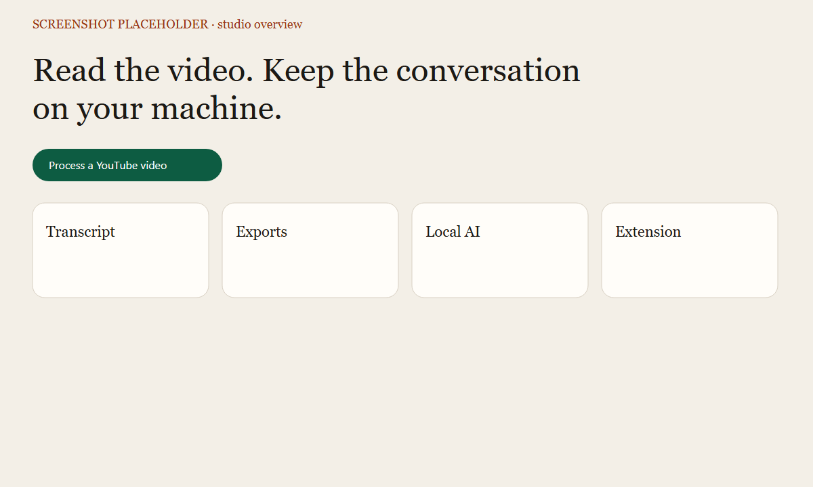
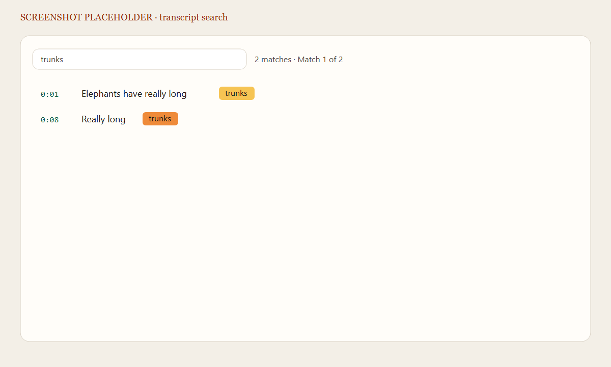
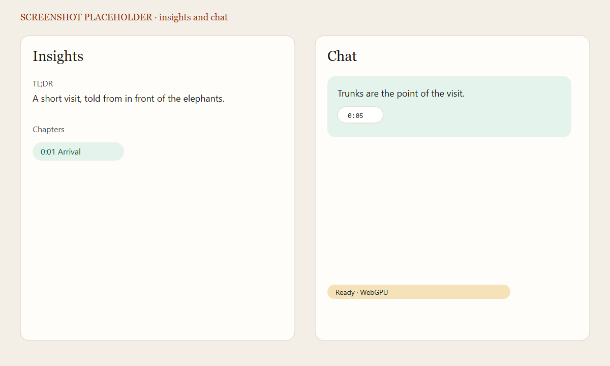
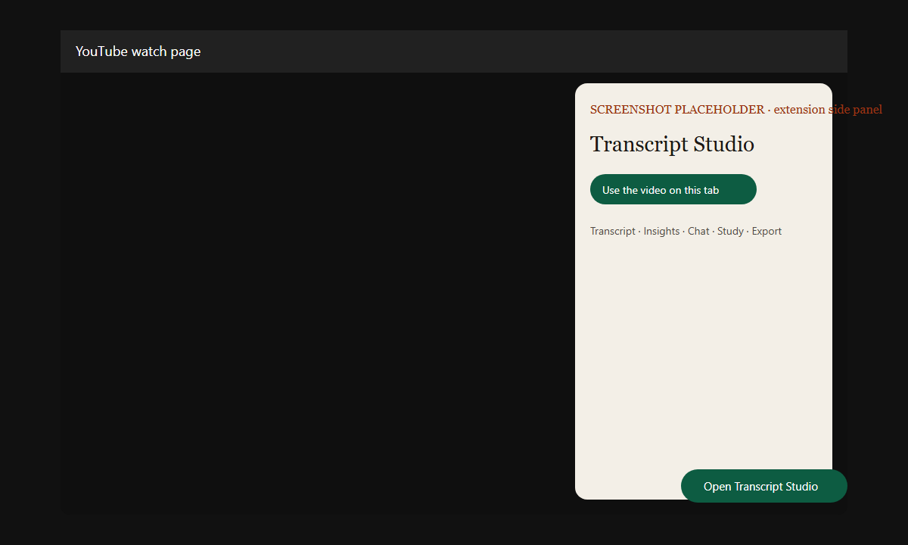
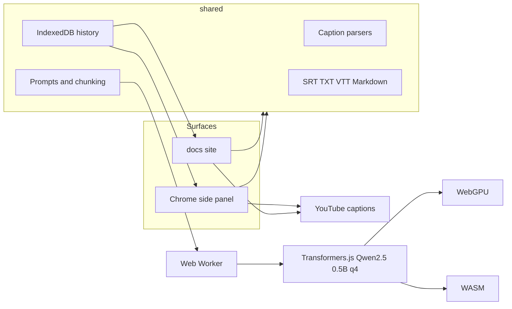

# YouTube Transcript Studio

**Read a YouTube video, export the captions, and study them with an AI that never leaves your browser.**

[](LICENSE)
[](https://www.typescriptlang.org/)
[](extension/manifest.json)
[](https://lcarlini.github.io/YouTubeTranscriptStudio/)
[](https://huggingface.co/onnx-community/Qwen2.5-0.5B-Instruct)

**Live site:** [https://lcarlini.github.io/YouTubeTranscriptStudio/](https://lcarlini.github.io/YouTubeTranscriptStudio/) · source entry [`site/index.html`](site/index.html)

YouTube Transcript Studio is a static website and a Chrome extension for people who want the words from a video without sending those words to a hosted chatbot. Captions stay in the tab. Summaries, flashcards, quizzes, and chat run in a Web Worker through [Transformers.js](https://huggingface.co/docs/transformers.js).

## Product

Paste a YouTube URL and choose **Process video**. The studio loads the caption track, shows it with timestamps, and keeps a local history of what you have opened. From there you can search, edit, export, or ask the on-device model questions that have to point back at a timestamp.

| Surface | What it is |
| --- | --- |
| [`/site`](site/index.html) | Website source. The production build is committed in [`/docs`](docs/index.html) for GitHub Pages. |
| [`/extension`](extension/manifest.json) | Manifest V3 side panel for `youtube.com/watch` pages. |
| [`/shared`](shared/src/index.ts) | Transcript parsing, exports, prompts, IndexedDB, and the model client. |

## Key features

- Timestamped transcript with search, match counts, previous/next, and per-line editing that keeps the original times.
- Click a timestamp to open YouTube at that second. In the extension, the click seeks the active player when the page allows it.
- Downloads: SRT, TXT, WebVTT, and Markdown. Markdown can include the TL;DR, takeaways, chapters, glossary, action items, flashcards, and chat.
- Insights from the local model: TL;DR, takeaways, chapters, glossary, action items, and follow-up questions. Long transcripts are chunked and merged.
- Chat answers that cite transcript times. If the model cannot ground a claim, the studio says so.
- Study tab: flip cards, a multiple-choice quiz with instant feedback, Anki CSV, and Markdown export.
- Recent videos in IndexedDB, with delete and clear. History is stored only in the browser.
- English, Brazilian Portuguese, and Spanish UI. The transcript and chat text are not machine-translated.
- Model status for checking, downloading, loading, ready, and generating, plus cache size and a button to clear the local model cache.

## Screenshots

These are labeled interface mockups. Replace them with captures from your own browser when you want photographs in the README.

| Studio overview | Transcript search |
| --- | --- |
|  |  |

| Insights and chat | Extension side panel |
| --- | --- |
|  |  |

## Architecture



## How it works

1. The URL parser accepts `watch`, `youtu.be`, `embed`, `shorts`, `live`, and a bare 11-character id.
2. Caption discovery calls YouTube's Innertube player endpoint and reads `captionTracks`. The chosen track is parsed from srv3 XML, classic timedtext, JSON3, WebVTT, or SRT.
3. `npm run dev` proxies that request through Vite, because a page on another origin cannot read `youtube.com` directly.
4. YouTube only returns caption tracks to `https://www.youtube.com`. The extension reads them inside a YouTube embed and passes the transcript to the side panel or the website. A button on the watch page opens the side panel.
5. The first time you generate insights, chat, or a study set, a worker downloads `onnx-community/Qwen2.5-0.5B-Instruct`. Later visits use the Transformers.js browser cache.
6. The worker asks for the high-performance WebGPU adapter (a discrete card such as an RTX 5070) and loads `dtype: "q4"` on it. If that 4-bit build cannot start, it tries `q4f16` on the same GPU. WASM `uint8` is used only when no real GPU adapter is available, or when both GPU builds fail to start.
7. Chat retrieval picks transcript lines by word overlap, sends those excerpts to the model, and keeps the answer only when it cites a timestamp from the text.

## Local model

| | |
| --- | --- |
| Model | [`onnx-community/Qwen2.5-0.5B-Instruct`](https://huggingface.co/onnx-community/Qwen2.5-0.5B-Instruct) |
| Task | `text-generation` |
| Quantization | `q4` on the high-performance GPU, then `q4f16` on that GPU; WASM `uint8` only if the GPU cannot start the model |
| Runtime | Transformers.js inside a dedicated Web Worker |
| Threads | One WASM thread, so GitHub Pages does not need cross-origin isolation |
| Cache | Browser Cache API (`transformers-cache`) plus `navigator.storage` |
| Weights | Not committed. The first download is hundreds of megabytes. |

Inference does not call OpenAI, Anthropic, Google AI, or any other remote LLM API. The only remote reads are the caption request, the public oEmbed title, and the one-time model download from Hugging Face.

## Install the website

```bash
git clone https://github.com/lcarlini/YouTubeTranscriptStudio.git
cd YouTubeTranscriptStudio
npm install
npm run dev
```

Open `http://localhost:5173`. Local development proxies caption requests to YouTube, which is the reliable way to process a URL in the website.

Production build:

```bash
npm run build -w @yts/docs
npm run preview
```

The preview serves the built site in `docs/` as a static site. There is no backend.

## Install the Chrome extension

The unpacked extension is the `/extension` folder. `dist/` inside it is produced by `npm run build -w @yts/extension` and is safe to load after that build.

1. Download or clone the repository.
2. Open `chrome://extensions`.
3. Enable Developer mode.
4. Click "Load unpacked".
5. Select the `/extension` folder.

On a YouTube watch page, use **Open Transcript Studio**. The toolbar icon opens the same side panel. Timestamp clicks seek the player on that tab when the content script can see the `<video>` element; otherwise they open the watch URL at that time.

If captions are missing, the panel explains that and offers a paste box for SRT, WebVTT, or plain text.

## Usage

| Action | How |
| --- | --- |
| Process | Paste a YouTube URL and press **Process video**. |
| Search | Type in the transcript search box. `/` focuses it. Enter moves to the next match. |
| Copy | **Copy transcript**, or the copy control on a line. `Ctrl+Shift+C` copies the full transcript. |
| Tabs | Transcript, Insights, Chat, Study, Export. `Alt+1` through `Alt+5` switch them. Arrow keys move across the tab list. |
| Export | SRT, TXT, WebVTT, or Markdown. Markdown can include the chat log. |
| Study | Generate a set, flip a card, answer the quiz, then export Anki CSV or Markdown. |
| History | Reopen a saved video without downloading captions again, or delete one item or the whole list. |
| Language | The header selector saves `en`, `pt-BR`, or `es` in `localStorage`. The first visit follows the browser language. |
| Model | Settings shows status, WebGPU or WASM, cache size, and **Clear local model cache**. |

## Languages

| Code | Language |
| --- | --- |
| `en` | English, the default |
| `pt-BR` | Portuguese (Brazil) |
| `es` | Spanish |

Add a language by copying `shared/src/i18n/en.ts`, filling every key, and registering it in `shared/src/i18n/index.ts` and the header `<select>`. A unit test fails if a catalog drifts from English.

## Privacy

No video transcript, chat message, or personal data is sent to a remote AI provider.

History, edits, insights, flashcards, and chat live in IndexedDB and `localStorage` on that browser profile. The model weights, once downloaded, stay in the browser cache. Clearing the model cache or the site data removes them.

Caption fetching is separate from inference:

- The extension loads captions inside a YouTube embed, where YouTube allows the player request, and passes the transcript to the side panel or the website.
- Local `npm run dev` requests captions through the Vite dev proxy on your machine.
- The static GitHub Pages build cannot call YouTube's player API itself. With the extension installed, the page asks that embed bridge for the transcript. Otherwise you can paste a caption file. Chat text is still not uploaded.

## Enable GitHub Pages

The site source is [`site/index.html`](site/index.html). `npm run build -w @yts/docs` writes the static site into [`/docs`](docs/index.html), which is the folder GitHub Pages already publishes from `main`. [`.github/workflows/pages.yml`](.github/workflows/pages.yml) builds that same folder and can deploy it when Pages is set to GitHub Actions.

1. Push to `main`.
2. In the repository, open **Settings → Pages**.
3. Set **Source** to **GitHub Actions**.
4. Open [https://lcarlini.github.io/YouTubeTranscriptStudio/](https://lcarlini.github.io/YouTubeTranscriptStudio/).

Asset URLs are relative (`base: "./"`), so the built site works on the project Pages URL without a hardcoded subpath.

## Development

```bash
npm install
npm run dev          # website
npm run build        # docs/ and extension/dist
npm run typecheck
npm run lint
npm test
npm run check        # typecheck, lint, test, and build
```

| Path | Role |
| --- | --- |
| `shared/src/youtube` | URL parsing and caption fetch |
| `shared/src/transcript` | XML, JSON3, VTT, SRT, and plain-text parsing |
| `shared/src/export` | SRT, TXT, VTT, Markdown, Anki CSV |
| `shared/src/ai` | Chunking, prompts, output parsers, model worker |
| `shared/src/ui` | Studio interface mounted by the site and the side panel |
| `shared/src/i18n` | UI catalogs |
| `site` | Website source |
| `docs` | Built website published by GitHub Pages |
| `extension` | Manifest, side panel, content script, service worker |

Regenerate the extension icons with `node scripts/generate-icons.mjs`.

## Testing

Vitest covers URL parsing, every caption format, search matches, exporters, chunk merge, citation parsing, flashcards, quiz parsing, i18n key parity, IndexedDB history, and mocked YouTube responses for a valid track, a video with no captions, and a CORS failure.

```bash
npm test
npm run typecheck
npm run lint
npm run build
```

A real caption download can be checked from Node, which is not subject to browser CORS:

```bash
npx vite-node scripts/smoke-transcript.ts
```

With `npm run preview` already running, `node scripts/ui-smoke.mjs` opens the production build in headless Chrome and checks invalid URLs, pasted captions, search highlighting, the study tab, and Portuguese and Spanish labels.

The local model is not downloaded during unit tests. Loading it is a manual check in the browser after **Generate insights** or a chat message. The status pill should move through checking, downloading, loading, and ready, and a second visit should stay on ready without another full download.

## Contributing

Issues and pull requests are welcome.

- Keep transcript parsing, exports, storage, and prompts in `shared` so the site and the extension cannot drift.
- Run `npm run check` before opening a pull request.
- Do not add API keys, account systems, or a hosted LLM.
- Do not commit model weights or `node_modules`.
- New UI copy needs an English key plus `pt-BR` and `es` entries. The catalog test enforces that.
- Extension changes need a rebuilt `extension/dist` if you want **Load unpacked** to pick up the new bundle.

## License

[MIT](LICENSE) © 2026 Leandro Carlini Mingorance
